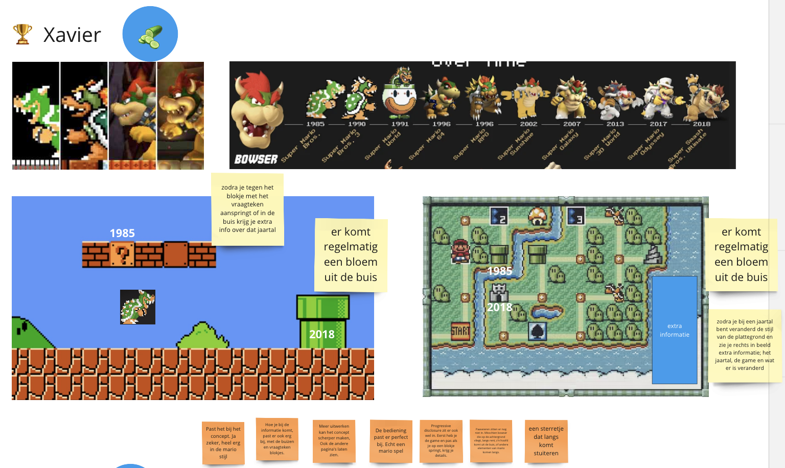
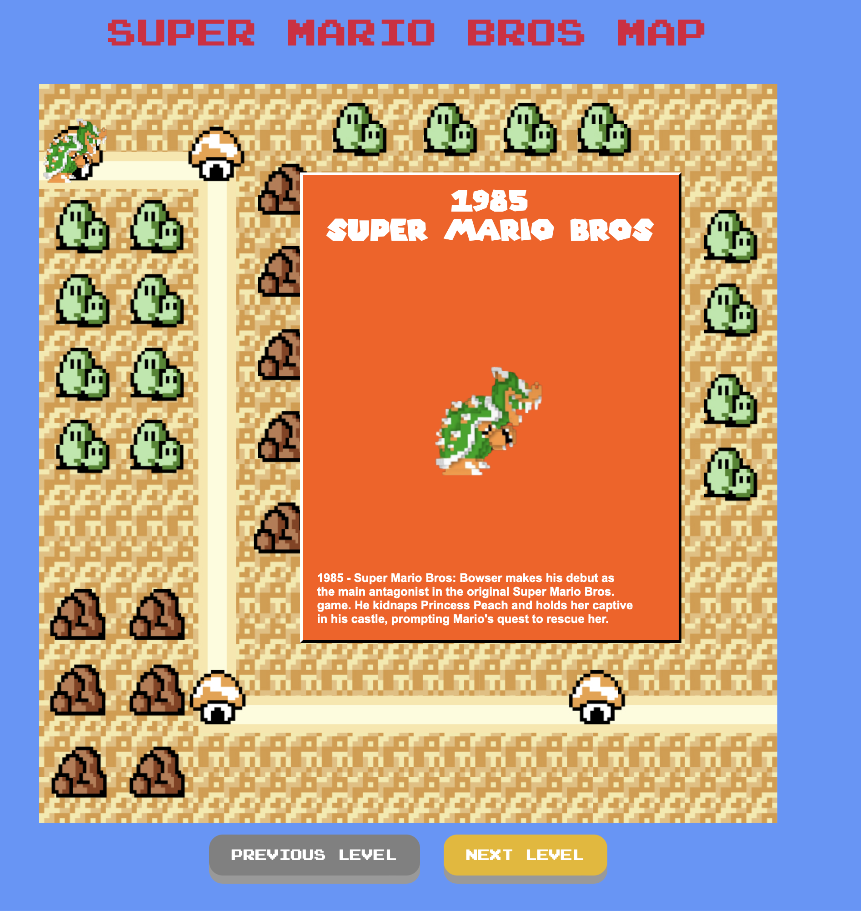

# Procesverslag

Markdown is een simpele manier om HTML te schrijven.  
Markdown cheat cheet: [Hulp bij het schrijven van Markdown](https://github.com/adam-p/markdown-here/wiki/Markdown-Cheatsheet).

Nb. De standaardstructuur en de spartaanse opmaak van de README.md zijn helemaal prima. Het gaat om de inhoud van je procesverslag. Besteedt de tijd voor pracht en praal aan je website.

Nb. Door _open_ toe te voegen aan een _details_ element kun je deze standaard open zetten. Fijn om dat steeds voor de relevante stuk(ken) te doen.

## Jij

### Ontwerper:

Xavier 

#### Je startniveau:

Mijn startniveau is: Blauw

# Je plan

### De eerste versie/schets:

  
De eerste versie/schets van je ontwerp & je persoonlijke uitdaging
   
  

### Je ambitie:

Aan deze technieken/punten wil ik werken:

- vormgeving
- leren animeren met javascript
- nette code maken

## Voortgang/Feedback 1

  
Mijn bevindingen + wijzigingen

### Bevinding 1:

Wat erg slordig van mij was, was dat ik het vierkantje waar Bowser in staat met extra informatie had gemaakt met figma.
Dit had ik dus niet gecodeerd.

#### oplossing:

ik heb dit opgelost door een section toe te voegen en het te coderen 

### Bevinding 2:

al mijn codes stonden allemaal op dezelfde lijn.

#### oplossing:

dit heb ik opgelost door met de tabknop de codes verder naar rechts te verschuiven

### Bevinding 3:

alle lettertypes zijn nog standaard en dus hetzelfde.

### oplossing:

ik heb fonts gedownload en font faces gebruikt

## Voortgang/Feedback 2

  
Mijn bevindingen + wijzigingen

  
  ### Bevinding 1:
tabindex mag ik niet gebruiken

#### oplossing:

ik gebruikte tab index omdat ik dacht dat ik mijn knoppen anders niet kon selecteren. Achteraf bleek het dat dit wel lukte in chrome,
maar dus niet in safari

### Bevinding 2:

de huisjes van de levels stonden op random plekken

#### oplossing:

ik heb er een paar toegevoegd en veranderd zodat bowser telkens op de juiste plek terecht komt

### Bevinding 3:

alhoewel ik 4 levels heb, kan je bij level 4 nog steeds op next klikken, ik moet dit dus disablen.

#### oplossing:

dit heb ik opgelost door een disabled state toe te voegen

## Voortgang/Feedback 3

  
Mijn bevindingen + wijzigingen 

  
  ### Bevinding 1:
responsiveness, zodra ik het scherm kleiner maakte werd, de tekst niet kleiner

#### oplossing:

ik heb dit opgelost door font size clamp te gebruiken

### Bevinding 2:

geen custom properties

#### oplossing:

dit heb ik opgelost door een root toe te voegen met de namen en kleuren

### Bevinding 3:

volgorde code. alles staat door elkaar

#### oplossing:
opgelost door eerst de custom properties toe te voegen, dan de algemene styling, dan de structuur en layout en ten slotte de rest

## Reflectie

  
Mijn eindresultaat & persoonlijke ontwikkeling

### Je uitkomst - karakteristiek screenshot(s):
   

  

### Dit ging goed/Heb ik geleerd:
Ik heb heel veer verschillende dingen geleerd:
- animeren
- nette code maken
- tekst positioneren
- knop disablen
- tekst responsive maken

### Dit was lastig/Is niet gelukt:

wat ik lastig vond was hoe ik het poppetje kon bewegen van level naar level. Gelukkig is dit wel gelukt uiteindelijk
Ook vond ik het moeilijk om het poppetje te laten veranderen per klik. Ook dit is gelukt uiteindelijk.

## Bronnenlijst

continu bijhouden terwijl je werkt

Nb. Wees specifiek ('css-tricks' als bron is bijv. niet specifiek genoeg).

1. https://chat.openai.com
2. https://mechants.fandom.com/fr/wiki/Bowser/Histoire
3. https://www.dafont.com/super-mario-256.font3. 
4. https://www.dafont.com/minecraft.font
5. https://www.w3schools.com/css/css3_buttons.asp

